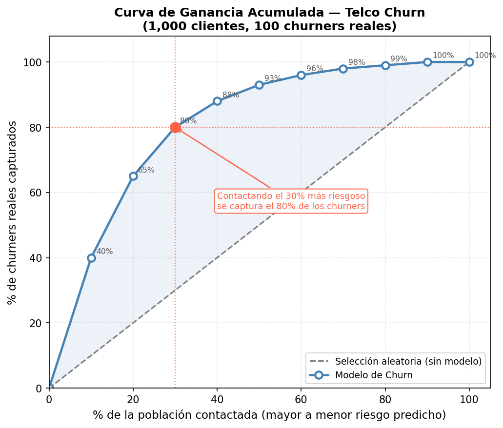
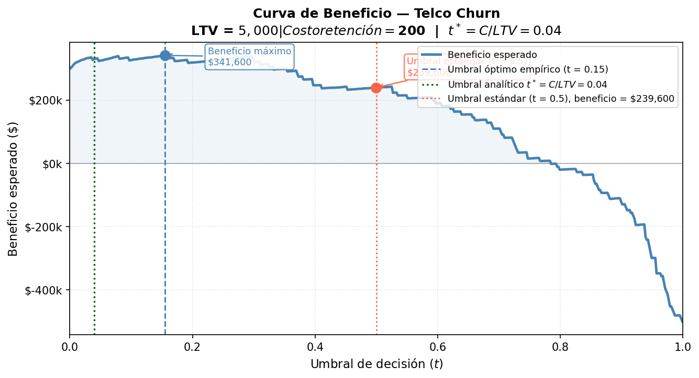

# La Evaluación de Modelos como Herramienta Financiera

## Objetivos de Aprendizaje

Al finalizar este capítulo, serás capaz de:

- Profundizar la Matriz de Confusión más allá de la exactitud y conectar cada celda con un costo operativo real
- Demostrar numéricamente la Paradoja de la Exactitud y sus consecuencias en decisiones de negocio
- Construir e interpretar la Curva ROC y la Curva Precision–Recall, y elegir cuál es apropiada según el contexto
- Traducir la Matriz de Confusión en un Estado de Resultados financiero para comparar modelos en términos de valor monetario
- Construir tablas de deciles y gráficos de Ganancia Acumulada (Cumulative Gain) y Elevación (Lift)
- Trazar una Curva de Beneficio (Profit Curve) y encontrar el umbral óptimo de decisión

---

## Introducción: La Ilusión de la Exactitud

En el Capítulo 2 introdujimos la Matriz de Confusión y las métricas derivadas: Accuracy, Precision, Recall y F1-Score. También presentamos la Curva ROC como herramienta de evaluación visual. Ese capítulo nos equipó con el vocabulario esencial.

Sin embargo, conocer el vocabulario no es suficiente. En ese capítulo respondimos la pregunta *"¿qué tan preciso es el modelo?"*. En este capítulo responderemos una pregunta mucho más relevante para la organización: **"¿cuánto dinero genera o ahorra este modelo?"**

### El Escenario que Cambia Todo

Imagina que eres analista en un banco. Tu equipo ha entrenado un modelo de detección de fraude y llega a la reunión de directivos con una sonrisa y el siguiente resultado:

> "Nuestro nuevo modelo tiene una **exactitud (Accuracy) del 99.9%**."

Los directivos aplauden. El presupuesto se aprueba. El modelo se despliega en producción.

Seis meses después, el banco descubre que sus pérdidas por fraude no han cambiado. El modelo, con toda su exactitud, era inútil.

¿Qué salió mal? El modelo aprendió a predecir **siempre "no es fraude"**, porque el fraude representa solo el 0.1% de las transacciones. Un modelo que nunca hace nada tiene el 99.9% de exactitud en este contexto, porque el 99.9% de los casos son legítimos.

### La Pregunta del Capítulo

**¿Cómo elegimos el modelo correcto cuando el negocio tiene costos asimétricos?**

La respuesta requiere ir más allá de las métricas estadísticas y construir un puente directo entre el desempeño del modelo y el estado de resultados de la empresa.

---

## Repaso Profundo: La Matriz de Confusión

### Las Cuatro Celdas Revisadas

En el Capítulo 2 presentamos la tabla de forma compacta. Ahora la analizamos desde la perspectiva operativa:

|                        | **Real: Negativo**| **Real: Positivo**|
|------------------------|-------------------------------|----------------------------|
| **Predicho: Negativo** | Verdadero Negativo (TN)       | Falso Negativo (FN)        |
| **Predicho: Positivo** | Falso Positivo (FP)           | Verdadero Positivo (TP)    |

Recordatorio de la notación:

- **TP (Verdadero Positivo)**: El modelo predijo "positivo" y tenía razón. 
- **TN (Verdadero Negativo)**: El modelo predijo "negativo" y tenía razón. 
- **FP (Falso Positivo)**: El modelo predijo "positivo" pero estaba equivocado.
- **FN (Falso Negativo)**: El modelo predijo "negativo" pero estaba equivocado.

### ¿Cuándo Es Más Caro Cada Error?

La clave del análisis financiero es que los dos tipos de error tienen costos radicalmente distintos dependiendo del contexto. No existe una respuesta universal.

**¿Cuándo es más caro el Falso Negativo (FN)?**

El FN es costoso cuando no detectar un evento positivo tiene consecuencias graves:

- **Fraude bancario**: No detectar una transacción fraudulenta significa absorber la pérdida completa, que puede ser de miles de pesos.
- **Diagnóstico médico de cáncer**: No detectar un tumor maligno en etapa temprana puede costar la vida del paciente.
- **Detección de fallas industriales**: No detectar que una pieza está próxima a fallar puede causar un paro de producción que cuesta millones.

En estos contextos, el negocio prefiere errar hacia la precaución: aceptar más FP con tal de minimizar los FN.

**¿Cuándo es más caro el Falso Positivo (FP)?**

El FP es costoso cuando activar el mecanismo de intervención tiene un precio alto:

- **Campañas de marketing de lujo**: Contactar a un prospecto no calificado para una tarjeta de crédito Platinum genera costos de adquisición (llamada, folleto, tiempo del ejecutivo) sin posibilidad de conversión, y puede dañar la percepción de marca.
- **Alertas de spam agresivas**: Filtrar como spam un correo legítimo puede hacer que un cliente pierda información importante, deteriorando la relación.
- **Alertas médicas quirúrgicas**: Realizar una cirugía innecesaria tiene costos humanos y financieros altísimos.

### Métricas Derivadas: Fórmulas y Ejemplo de Negocio

Usaremos el mismo escenario de Churn de telecomunicaciones a lo largo del capítulo. Supongamos que evaluamos nuestro modelo en un conjunto de prueba de 1,000 clientes:

| Resultado   | Cantidad |
|-------------|---------|
| TP          | 80      |
| TN          | 840     |
| FP          | 60      |
| FN          | 20      |
| **Total**   | **1,000** |

Con estos datos, calculemos todas las métricas:

**Accuracy (Exactitud)**

$$\text{Accuracy} = \frac{TP + TN}{Total} = \frac{80 + 840}{1{,}000} = \frac{920}{1{,}000} = 92\%$$

*Interpretación*: El modelo acierta en el 92% de los casos. Parece muy bueno. Pero no nos dice nada sobre si estamos perdiendo clientes valiosos.

**Precision (Precisión)**

$$\text{Precision} = \frac{TP}{TP + FP} = \frac{80}{80 + 60} = \frac{80}{140} \approx 57.1\%$$

*Interpretación*: De cada 100 clientes a quienes le enviamos una oferta de retención, solo 57 realmente iban a irse. El 43% restante era desperdicio de presupuesto de retención.

**Recall (Sensibilidad / Tasa de Detección)**

$$\text{Recall} = \frac{TP}{TP + FN} = \frac{80}{80 + 20} = \frac{80}{100} = 80\%$$

*Interpretación*: Detectamos el 80% de los clientes que realmente iban a irse. El 20% restante (20 clientes) se fue sin que los detectáramos.

**Specificity (Especificidad)**

$$\text{Specificity} = \frac{TN}{TN + FP} = \frac{840}{840 + 60} = \frac{840}{900} \approx 93.3\%$$

*Interpretación*: Del total de clientes leales, identificamos correctamente al 93.3%. Solo el 6.7% fue mal catalogado como "en riesgo".

**F1-Score**

El F1-Score es la media armónica de Precision y Recall. Penaliza fuertemente cuando cualquiera de los dos valores es muy bajo:

$$F1 = 2 \times \frac{\text{Precision} \times \text{Recall}}{\text{Precision} + \text{Recall}} = 2 \times \frac{0.571 \times 0.80}{0.571 + 0.80} \approx 0.667$$

*Interpretación*: Un F1 de 0.667 (66.7%) nos da una visión más honesta del modelo que el 92% de Accuracy. Es la métrica más usada cuando los datos están desbalanceados y no hay costos definidos.

### Tabla Resumen de Métricas

| Métrica        | Fórmula                        | Nuestro Modelo | Pregunta que Responde                               |
|----------------|--------------------------------|----------------|-----------------------------------------------------|
| Accuracy       | $(TP+TN)/Total$                | 92.0%          | ¿Qué porcentaje de predicciones son correctas?       |
| Precision      | $TP/(TP+FP)$                   | 57.1%          | ¿Cuánto confiar cuando el modelo dice "positivo"?   |
| Recall         | $TP/(TP+FN)$                   | 80.0%          | ¿Qué fracción de positivos reales capturamos?        |
| Specificity    | $TN/(TN+FP)$                   | 93.3%          | ¿Qué fracción de negativos reales identificamos?    |
| F1-Score       | $2 \cdot P \cdot R / (P+R)$   | 66.7%          | ¿Cuál es el balance entre Precision y Recall?       |

---

## La Paradoja de la Exactitud (Accuracy Paradox)

### La Demostración Numérica

Consideremos ahora un escenario más extremo: detección de fraude en tarjetas de crédito. Supongamos que de cada 10,000 transacciones, solo 10 son fraudulentas (0.1% de positividad).

**El "Modelo Ingenuo"**: Un modelo que simplemente predice *"no es fraude"* para cada transacción.

Su matriz de confusión sería:

|                        | **Real: Legítima** | **Real: Fraude** |
|------------------------|-------------------|-----------------|
| **Predicho: Legítima** | TN = 9,990        | FN = 10         |
| **Predicho: Fraude**   | FP = 0            | TP = 0          |

Calculemos sus métricas:

$$\text{Accuracy} = \frac{0 + 9{,}990}{10{,}000} = 99.9\%$$

$$\text{Precision} = \frac{0}{0 + 0} = \text{indefinida (0/0)}$$

$$\text{Recall} = \frac{0}{0 + 10} = 0\%$$

$$F1 = 0$$

**El resultado es un modelo con 99.9% de exactitud que no detecta un solo fraude.** Es el peor modelo de detección de fraude posible, y aun así la métrica de Accuracy lo hace parecer excepcional.

### Conclusión: Accuracy en Clases Desbalanceadas

La exactitud es una métrica **inútil y potencialmente peligrosa** cuando:

1. Las clases están altamente desbalanceadas (una clase es mucho más frecuente que la otra)
2. Los costos de los errores son asimétricos (un tipo de error es mucho más costoso que el otro)

Esto ocurre en prácticamente todos los casos de alto valor en negocios: fraude, detección de enfermedades, fallas industriales, abandono de clientes premium.

### Técnicas de Mitigación

| Técnica             | Descripción                                                              | Cuándo Usar                                  |
|---------------------|--------------------------------------------------------------------------|----------------------------------------------|
| **SMOTE**           | Genera sintéticamente nuevas instancias de la clase minoritaria          | Cuando el desbalance es severo (>10:1)       |
| **Class Weights**   | Penaliza más al modelo por errores en la clase minoritaria durante el entrenamiento | Ajuste simple y efectivo para la mayoría de casos |
| **Ajuste de Umbral**| Modifica el umbral de decisión de 0.5 a un valor que optimice la métrica financiera | Cuando se conocen los costos de los errores  |

En este capítulo nos enfocaremos principalmente en el **ajuste de umbral**, ya que es la técnica más directamente conectada al análisis financiero.

---

## El Trade-off Precision–Recall y la Curva ROC en Profundidad

### El Umbral Como Perilla de Control

En el Capítulo 2 establecimos que la Regresión Logística produce una **probabilidad**, no directamente una etiqueta. Para convertirla en una decisión binaria, aplicamos un umbral $t$:

$$\hat{y} = \begin{cases} 1 & \text{si } P(\text{Churn}) \geq t \\ 0 & \text{si } P(\text{Churn}) < t \end{cases}$$

Al variar $t$ de 0 a 1, obtenemos distintos puntos en el espacio Recall–Precision y Recall–FPR (Tasa de Falsos Positivos). Esto es precisamente lo que construyen las curvas ROC y Precision–Recall.

### La Curva ROC en Detalle

#### Construcción Punto a Punto

La Curva ROC (Receiver Operating Characteristic) se construye graficando, para cada umbral posible:

- **Eje Y**: Recall = $TP / (TP + FN)$ (también llamado Sensibilidad o Tasa de Verdaderos Positivos)
- **Eje X**: FPR = $FP / (FP + TN)$ (Tasa de Falsos Positivos)

| Umbral $t$ | TP | FP | FN | TN | Recall | FPR   |
|------------|----|----|----|----|--------|-------|
| 0.9        | 10 | 2  | 90 | 898| 10%    | 0.22% |
| 0.7        | 45 | 15 | 55 | 885| 45%    | 1.67% |
| 0.5        | 80 | 60 | 20 | 840| 80%    | 6.67% |
| 0.3        | 95 | 150| 5  | 750| 95%    | 16.7% |
| 0.1        | 100| 400| 0  | 500| 100%   | 44.4% |

Cada fila es un punto en la curva ROC. El umbral se convierte en una palanca que desplaza el punto a lo largo de la curva.

#### AUC: El Área Bajo la Curva

El **AUC (Area Under the Curve)** resume toda la curva en un único número entre 0 y 1.

$$\text{AUC} = \int_0^1 \text{Recall}(\text{FPR}) \, d(\text{FPR})$$

Pero antes de quedarnos con la fórmula, construyamos la intuición paso a paso.

**Paso 1 — La analogía del médico que ordena expedientes**

El modelo no toma una decisión final: hace algo más humilde. *Ordena* a los clientes de mayor a menor riesgo de irse, como un médico que revisa 100 expedientes y los apila de "más urgente" a "menos urgente" antes de que llegue el turno. La pregunta es: **¿qué tan bueno es ese orden?**

Trasladando esto al caso de Churn: el modelo revisa los 1,000 clientes del conjunto de prueba y los coloca en una fila, del que tiene mayor probabilidad de irse al que tiene menor. El equipo de retención solo puede llamar a los primeros 200. La pregunta no es "¿acertó el modelo en cada caso?", sino "**¿puso a los clientes que realmente se iban al frente de la fila?**"

**Paso 2 — Pintar los expedientes**

Imagina que pintamos de naranja los expedientes de los clientes que sí se fueron, y de azul los que se quedaron. Un modelo perfecto dejaría todos los naranjas en la parte superior de la pila y todos los azules en la inferior, sin ninguna mezcla. Un modelo inútil los mezclaría completamente al azar.

Los histogramas a continuación muestran exactamente esa mezcla: la distribución de probabilidades predichas para cada clase. Mucho traslape entre las dos campanas significa que el modelo confunde frecuentemente a churners con clientes leales. Poca mezcla significa que los separa bien.

**Paso 3 — El duelo aleatorio (definición precisa)**

Ahora podemos dar una definición exacta sin integrales:

> **AUC = si tomas al azar un cliente naranja (churner real) y uno azul (cliente leal), ¿cuál es la probabilidad de que el modelo le haya asignado una probabilidad más alta al naranja?**

AUC = 0.87 significa que en **87 de cada 100 duelos**, el modelo rankea correctamente al churner por encima del cliente leal. AUC = 0.50 significa que el modelo no distingue entre ambos — equivale a lanzar una moneda.

| Valor de AUC | Interpretación                                      |
|--------------|-----------------------------------------------------|
| 1.00         | Clasificador perfecto: todos los positivos rankeados encima de todos los negativos |
| 0.90–0.99    | Excelente: modelo muy discriminante                |
| 0.70–0.89    | Aceptable: rango típico en problemas reales de negocio |
| 0.60–0.69    | Mediocre: mejor que el azar, pero apenas            |
| 0.50         | Aleatorio: el modelo no distingue entre clases      |
| < 0.50       | Peor que el azar (posiblemente las clases están invertidas) |

### La Curva Precision–Recall

#### Por Qué el ROC-AUC Puede Engañarnos

Antes de presentar la alternativa, hay que entender cuándo el ROC-AUC falla. El problema está en el denominador del FPR:

$$\text{FPR} = \frac{FP}{FP + TN}$$

Cuando la clase negativa es enorme, $TN$ es un número gigante. Eso hace que incluso cientos de FP parezcan insignificantes.

**Ejemplo numérico**: detección de fraude con 9,900 transacciones legítimas y 100 fraudulentas. Si el modelo genera 500 alarmas falsas:

$$\text{FPR} = \frac{500}{500 + 9{,}400} = 5.1\%$$

La curva ROC apenas se mueve hacia la derecha. Se ve bien. Pero en la práctica, el equipo antifraude está investigando 500 casos falsos por cada 100 reales — una pesadilla operativa que el ROC-AUC oculta.

La Precision lo captura de inmediato porque su denominador es pequeño:

$$\text{Precision} = \frac{TP}{TP + FP}$$

Cada FP pesa directamente, sin importar cuántos negativos haya en el dataset.

La siguiente figura muestra el mismo punto de operación (TP=80, FP=500, Recall=80%) visto desde ambas curvas. En el ROC el punto apenas se aleja del eje Y. En el PR queda al descubierto: el 86% de las alarmas son falsas.

#### La Analogía del Buscador de Agujas

El ROC-AUC mide qué tan bien el modelo *rankea*: ¿pone las agujas antes que la paja en la fila? El PR-AUC mide algo distinto: qué tan bien el modelo *encuentra las agujas en el pajar*.

Cuando el pajar es enorme, saber que el modelo "rankea bien" es de poco consuelo si al revisar el top 10% de la lista igual encuentras más paja que agujas. Precision captura exactamente eso: de todo lo que el modelo señaló como aguja, ¿cuánto era realmente aguja?

#### La Curva y su Resumen Numérico

La **Curva Precision–Recall** grafica:

- **Eje Y**: Precision = $TP / (TP + FP)$
- **Eje X**: Recall = $TP / (TP + FN)$

Se resume con el **PR-AUC** (también llamado Average Precision): el área bajo esta curva. A diferencia del ROC-AUC, cuya línea base es siempre 0.50, la línea base del PR-AUC depende de la tasa de positividad del dataset — si solo el 5% de los casos son positivos, un modelo aleatorio tiene PR-AUC ≈ 0.05.

#### La Pregunta que Cada Curva Responde

| Curva | Pregunta que responde |
|---|---|
| **ROC-AUC** | ¿Rankea bien el modelo a los positivos sobre los negativos? |
| **PR-AUC** | Cuando el modelo dice "positivo", ¿cuánto podemos confiar en eso? |

### ¿Cuándo Usar ROC-AUC vs. PR-AUC?

| Situación                                        | Métrica Recomendada |
|--------------------------------------------------|---------------------|
| Clases balanceadas (50/50 aproximadamente)        | ROC-AUC             |
| Clases desbalanceadas, importa el desempeño en la clase minoritaria | PR-AUC              |
| Comparar modelos para una presentación ejecutiva | ROC-AUC (más conocida)|
| Fraude, detección médica, churn con baja tasa    | PR-AUC              |

---

## La Matriz de Confusión como Estado de Resultados

Esta es la transformación central del capítulo. Vamos a dejar de pensar en la Matriz de Confusión como una tabla estadística y comenzar a verla como un **estado de resultados financiero**.

### El Modelo de Costos

En el contexto de retención de clientes (Churn), definamos los parámetros financieros:

- **LTV** (Lifetime Value): Valor presente del ingreso neto que un cliente genera durante su ciclo de vida. Supongamos $LTV = \$5{,}000$ pesos por cliente.
- **$C_{retención}$**: Costo de la acción de retención (llamada del equipo, descuento ofrecido, etc.). Supongamos $C = \$200$ pesos.

### La Tabla de Valor Financiero

| Predicción \ Realidad | **Positivo** (Se va)              | **Negativo** (Se queda)     |
|-----------------------|-----------------------------------|-----------------------------|
| **Positivo** (Predicho)| **TP**: $+(LTV - C_{retención})$ | **FP**: $-C_{retención}$   |
| **Negativo** (Predicho)| **FN**: $-LTV$                   | **TN**: $\$0$               |

Interpretación de cada celda:

- **TP**: Detectamos a un cliente que se iba a ir y lo retuvimos. Ganamos su LTV pero pagamos el costo de retención. Beneficio neto = $\$5{,}000 - \$200 = \$4{,}800$
- **FP**: Contactamos a un cliente que no se iba a ir. Gastamos el costo de retención innecesariamente. Pérdida = $-\$200$
- **FN**: El cliente se fue sin que lo detectáramos. Perdemos todo su LTV futuro. Pérdida = $-\$5{,}000$
- **TN**: Cliente leal que no contactamos. Sin costo ni ganancia. = $\$0$

### La Esperanza Matemática del Beneficio

Con esta estructura, el beneficio esperado total del modelo es:

$$E[\text{Beneficio}] = TP \times (LTV - C) + FP \times (-C) + FN \times (-LTV) + TN \times 0$$

### Ejemplo Numérico Completo

Tomemos nuestros dos modelos hipotéticos, ambos con el mismo dataset de 1,000 clientes (100 churners reales) pero con matrices de confusión distintas:

**Modelo A (optimizado para Accuracy)**:

| Resultado | Cantidad |
|-----------|---------|
| TP        | 60      |
| TN        | 870     |
| FP        | 30      |
| FN        | 40      |

- Accuracy: $(60 + 870)/1{,}000 = 93\%$
- F1-Score: $\approx 0.67$

$$E[\text{Beneficio}_A] = 60 \times \$4{,}800 + 30 \times (-\$200) + 40 \times (-\$5{,}000) + 870 \times \$0$$

$$= \$288{,}000 - \$6{,}000 - \$200{,}000 = \$82{,}000$$

**Modelo B (optimizado para F1 con mayor Recall)**:

| Resultado | Cantidad |
|-----------|---------|
| TP        | 82      |
| TN        | 818     |
| FP        | 82      |
| FN        | 18      |

- Accuracy: $(82 + 818)/1{,}000 = 90\%$ ← ¡Menor!
- F1-Score: $\approx 0.67$

$$E[\text{Beneficio}_B] = 82 \times \$4{,}800 + 82 \times (-\$200) + 18 \times (-\$5{,}000) + 818 \times \$0$$

$$= \$393{,}600 - \$16{,}400 - \$90{,}000 = \$287{,}200$$

### Comparación Final

| Métrica          | Modelo A | Modelo B | Diferencia      |
|------------------|----------|----------|-----------------|
| Accuracy         | 93%      | 90%      | A gana por 3 pp |
| F1-Score         | 0.67     | 0.67     | Empate          |
| **Beneficio Esperado** | **$82,000** | **$287,200** | **B gana por $205,200** |

**Lección crítica**: El Modelo B tiene *menor* exactitud pero genera **3.5 veces más valor financiero**. Elegir por Accuracy habría costado a la empresa $205,200 pesos por cada ciclo de campaña.

---

## Análisis de Deciles y Curva de Ganancia Acumulada

Hasta ahora evaluamos el modelo con un umbral fijo. Ahora adoptamos una perspectiva de **priorización de recursos**: si no podemos contactar a todos los clientes en riesgo, ¿a cuáles deberíamos contactar primero?

### Construcción de la Tabla de Deciles

El procedimiento es el siguiente:

1. Aplicar el modelo y obtener la probabilidad de Churn $P(\text{Churn}_i)$ para cada cliente.
2. Ordenar a todos los clientes de mayor a menor probabilidad predicha.
3. Dividir la lista en 10 grupos iguales (deciles), donde el Decil 1 contiene el 10% con mayor probabilidad.
4. Para cada decil, contar cuántos churners reales contiene.

**Tabla de Deciles — Telco Churn (1,000 clientes, 100 churners reales)**

| Decil | Rango de Prob.  | Clientes | Churners en Decil | % Churners en Decil | Churners Acum. | % Acum. Capturado |
|-------|-----------------|----------|--------------------|---------------------|----------------|-------------------|
| 1     | 0.90 – 1.00     | 100      | 40                 | 40%                 | 40             | 40%               |
| 2     | 0.70 – 0.90     | 100      | 25                 | 25%                 | 65             | 65%               |
| 3     | 0.50 – 0.70     | 100      | 15                 | 15%                 | 80             | 80%               |
| 4     | 0.35 – 0.50     | 100      | 8                  | 8%                  | 88             | 88%               |
| 5     | 0.25 – 0.35     | 100      | 5                  | 5%                  | 93             | 93%               |
| 6     | 0.15 – 0.25     | 100      | 3                  | 3%                  | 96             | 96%               |
| 7     | 0.08 – 0.15     | 100      | 2                  | 2%                  | 98             | 98%               |
| 8     | 0.04 – 0.08     | 100      | 1                  | 1%                  | 99             | 99%               |
| 9     | 0.01 – 0.04     | 100      | 1                  | 1%                  | 100            | 100%              |
| 10    | 0.00 – 0.01     | 100      | 0                  | 0%                  | 100            | 100%              |

### La Curva de Ganancia Acumulada (Cumulative Gain Chart)

La Curva de Ganancia Acumulada grafica:

- **Eje X**: % de la población contactada (en orden descendente de probabilidad)
- **Eje Y**: % de churners reales capturados

Dos curvas se grafican juntas:

1. **Curva del Modelo**: Construida con la tabla anterior
2. **Línea Base (Aleatoria)**: Si contactáramos al azar, cada 10% de la población capturaría exactamente el 10% de los churners

**Lectura práctica**: Si contactamos solo al **30% más riesgoso** (los tres primeros deciles), capturamos el **80% de todos los churners**. Si eligiéramos clientes al azar, necesitaríamos contactar al 80% de la base para lograr lo mismo.

La distancia vertical entre la curva del modelo y la línea base mide el valor del modelo: más separación equivale a mayor eficiencia.

---

## El Gráfico de Elevación (Lift Chart)

### Definición de Lift

El Lift mide cuánto **mejor** que el azar es el modelo en un decil específico:

$$\text{Lift}_{decil} = \frac{\% \text{ de churners en el decil}}{\% \text{ de churners en la población total}}$$

En nuestro ejemplo, la tasa base de churn es $100/1{,}000 = 10\%$.

### Tabla de Lift por Decil

| Decil | Churners en Decil | % Churners en Decil | Lift = % Decil / % Base | Lift Acum. |
|-------|--------------------|--------------------|-------------------------|------------|
| 1     | 40                 | 40%                | 40% / 10% = **4.0x**   | 4.0x       |
| 2     | 25                 | 25%                | 25% / 10% = **2.5x**   | 3.25x      |
| 3     | 15                 | 15%                | 15% / 10% = **1.5x**   | 2.67x      |
| 4     | 8                  | 8%                 | 8% / 10% = **0.8x**    | 2.2x       |
| 5–10  | 12 (total)         | Decreciente        | < 1x                   | —          |

### Interpretación para Decisiones de Negocio

El Lift del primer decil es **4.0x**. Esto significa:

> "Si contactamos al 10% de clientes con mayor probabilidad de irse, encontraremos **cuatro veces más churners** de los que encontraríamos contactando al azar."

El Lift acumulado de los tres primeros deciles es **2.67x**, lo que quiere decir:

> "Contactando al 30% de la base (los más riesgosos), el modelo es **2.67 veces** más eficiente que una selección aleatoria."

Este número es el que se lleva a la dirección financiera para justificar la inversión en el modelo. La pregunta ejecutiva es: **"¿Cuánto valen esas 2.67 veces de eficiencia en términos del presupuesto de retención?"**

---

## Curvas de Beneficio (Profit Curves)

### La Herramienta Culminante

Las curvas de Lift y Ganancia responden: *"¿A quiénes debo contactar primero?"*

La Curva de Beneficio responde la pregunta definitiva: *"¿Cuál es el umbral de decisión que maximiza el beneficio total de la campaña?"*

### Construcción

Para cada umbral $t$ posible entre 0 y 1:

1. Clasificar a cada cliente como "en riesgo" si $P(\text{Churn}_i) \geq t$ y "seguro" en caso contrario.
2. Con esa clasificación, construir la Matriz de Confusión correspondiente.
3. Calcular el Beneficio Esperado:

$$\text{Beneficio}(t) = TP(t) \times (LTV - C) + FP(t) \times (-C) + FN(t) \times (-LTV)$$

4. Graficar:
   - **Eje X**: Umbral $t$ (de 0 a 1)
   - **Eje Y**: Beneficio total esperado en pesos

### La Curva Tiene Forma de Montaña

- **Umbral muy bajo** ($t \approx 0$): Contactamos a todos los clientes. Muchos FP; el costo de retención disperso supera el beneficio.
- **Umbral muy alto** ($t \approx 1$): Solo contactamos a los casi-seguros. Pocos FP pero también pocos TP; perdemos muchos churners.
- **Umbral óptimo** ($t^*$): El punto que maximiza la curva, donde el beneficio marginal de contactar a un cliente adicional es exactamente cero.

El umbral óptimo casi nunca es $t = 0.5$. En contextos donde el LTV es muy alto relativo al costo de retención, el umbral óptimo suele ser más bajo (más agresivo), porque vale la pena asumir más FP para no perder churners.

La fórmula analítica del umbral óptimo, cuando los costos son constantes, es:

$$t^* = \frac{C}{LTV}$$

En nuestro ejemplo: $t^* = \$200 / \$5{,}000 = 0.04$

Esto significa que debería intervenir con cualquier cliente que tenga más del 4% de probabilidad de irse. A ese LTV y ese costo, la apuesta financiera es favorable.

## Resumen y Conexión con el Siguiente Módulo

### Tabla Resumen: Cuándo Usar Cada Herramienta

| Herramienta / Métrica     | Úsala cuando...                                                          | Evítala cuando...                                           |
|---------------------------|--------------------------------------------------------------------------|-------------------------------------------------------------|
| **Accuracy**              | Clases balanceadas, costos simétricos                                    | Clases desbalanceadas o costos asimétricos                  |
| **Precision**             | El costo de FP es alto (campañas de lujo, alertas costosas)              | El costo de FN supera ampliamente al de FP                  |
| **Recall**                | El costo de FN es alto (fraude, diagnóstico médico)                      | El presupuesto de intervención es muy limitado              |
| **F1-Score**              | No hay información de costos y las clases están desbalanceadas           | Se conocen los costos; en ese caso, usar el beneficio esperado |
| **ROC-AUC**               | Comparar modelos globalmente, clases moderadamente balanceadas           | Clases muy desbalanceadas (usar PR-AUC en su lugar)         |
| **PR-AUC**                | Fraude, churn de nicho, detección médica (clases muy desbalanceadas)     | Clases balanceadas (ROC-AUC es más interpretable)           |
| **Beneficio Esperado**    | Se conocen LTV, costos, siempre que se pueda cuantificar el valor        | Cuando los costos son inciertos o muy variables             |
| **Lift / Gain Chart**     | Optimizar presupuestos de campaña, priorizar intervenciones              | Cuando se puede contactar al 100% de la base (sin restricción)|
| **Profit Curve**          | Definir el umbral óptimo de decisión para maximizar valor financiero     | Cuando los costos son inciertos                             |

### Los Tres Aprendizajes Clave del Capítulo

1. **La Accuracy miente en contextos reales**: El 99.9% de los problemas de negocio de alto impacto involucran clases desbalanceadas. Usar Accuracy como métrica principal es una garantía de tomar decisiones subóptimas.

2. **El umbral de decisión no es 0.5**: El umbral óptimo lo determina la relación entre el costo de retención y el valor de un cliente, no una convención estadística. La fórmula $t^* = C / LTV$ da una primera aproximación analítica.

3. **Dos modelos con igual AUC pueden tener beneficios financieros radicalmente distintos**: Lo que importa no es el área bajo la curva sino el valor del punto específico de la curva donde operamos en producción.

### Conexión con el Siguiente Capítulo

Ahora que tenemos las herramientas para **evaluar** cualquier modelo de clasificación en términos financieros, estamos listos para aprender **nuevos modelos** que podremos evaluar con exactamente este mismo framework.

El Capítulo 4 introduce los **Árboles de Decisión**: modelos que, a diferencia de la Regresión Logística, no asumen ninguna forma funcional para separar las clases. Son completamente interpretables, soportan relaciones no lineales y producen reglas de negocio en lenguaje casi natural.

Aplicaremos las Curvas de Beneficio y los Lift Charts del Capítulo 3 para comparar si un Árbol de Decisión supera a la Regresión Logística en el caso de Churn, cerrando el ciclo entre modelado, evaluación y valor de negocio.
